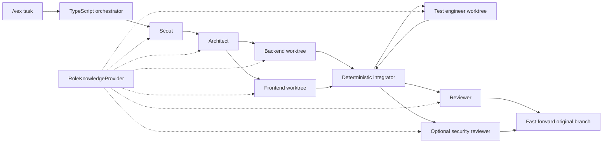

# VEX

VEX is a fixed-role, multi-agent coding package for [Pi](https://github.com/earendil-works/pi). It keeps orchestration in deterministic TypeScript code while giving each model role an isolated context and a narrow coding direction.

VEX is a Pi extension, not a fork. It uses Pi for model access and coding tools, Bun for development, and Git worktrees for isolated changes.

## Architecture



Only the TypeScript orchestrator creates role sessions. Every model role declares `spawns: []`. The `integrator` is ordinary Git code and never calls a model.

| Role                | Direction                                       | Writes                       |
| ------------------- | ----------------------------------------------- | ---------------------------- |
| `scout`             | Repository evidence and constraints             | No                           |
| `architect`         | Bounded assignments and ownership               | No                           |
| `backend`           | CLI, server, data, protocol, non-visual logic   | Isolated worktree            |
| `frontend`          | UI, interaction, accessibility, visual behavior | Isolated worktree            |
| `test-engineer`     | Focused automated coverage after integration    | Isolated worktree            |
| `reviewer`          | Correctness, regressions, missing coverage      | No                           |
| `security-reviewer` | Optional trust-boundary review                  | No                           |
| `integrator`        | Ordered cherry-picks and final fast-forward     | Deterministic Git operations |

See [docs/architecture.md](docs/architecture.md) for the execution model and state layout.

## Install

Prerequisites: Git, Bun, and Pi `0.84.1` or newer.

```bash
git clone https://github.com/jkesh/Vex.git
cd Vex
bun install
bun run check
pi install .
```

To try the local package without installing it:

```bash
pi -e /absolute/path/to/Vex
```

## Commands

```text
/vex <task>                 start a fixed-role coding run
/vex --security <task>      include the security reviewer
/code <task>                alias for /vex
/vex-status                 show the latest persisted run
/vex-abort                  stop active Pi child processes
/vex-cleanup                remove worktrees from the latest failed run
```

The target repository must have a clean working tree. Successful runs fast-forward the original branch only after implementation, tests, and review complete. Failed runs preserve their worktrees for inspection.

VEX stores internal state and generated role prompts under the repository Git common directory at `.git/vex/runs/<run-id>/`. Writer worktrees live beside the repository under `.vex-worktrees/` and are removed after a successful run.

## RAG Interface

RAG is intentionally an interface in v1. The default `NoopKnowledgeProvider` returns no documents, so VEX has no vector database, embedding model, sidecar, or MCP requirement.

Implement one provider and inject it through the extension factory:

```ts
import { createVexExtension } from "pi-vex/extension";
import type { RoleKnowledgeProvider } from "pi-vex/knowledge";

const provider: RoleKnowledgeProvider = {
  name: "company-search",
  async retrieve(request) {
    const documents = await searchYourSystem({
      query: request.query,
      role: request.role,
      limit: request.limit,
      filters: request.filters,
      signal: request.signal,
    });
    return { provider: this.name, documents };
  },
};

export default createVexExtension({ knowledgeProvider: provider });
```

`RoleKnowledgeClient` bounds result count and document size, and fails open by default. A provider can wrap a local index, a vector database, an HTTP service, a graph retriever, an MCP client, or hybrid search without changing the orchestrator.

## Development

```bash
bun install
bun run typecheck
bun test
npm pack --dry-run
```

VEX is licensed under Apache-2.0.
