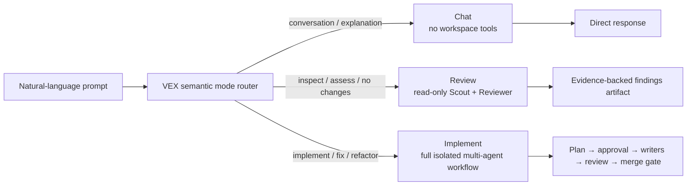
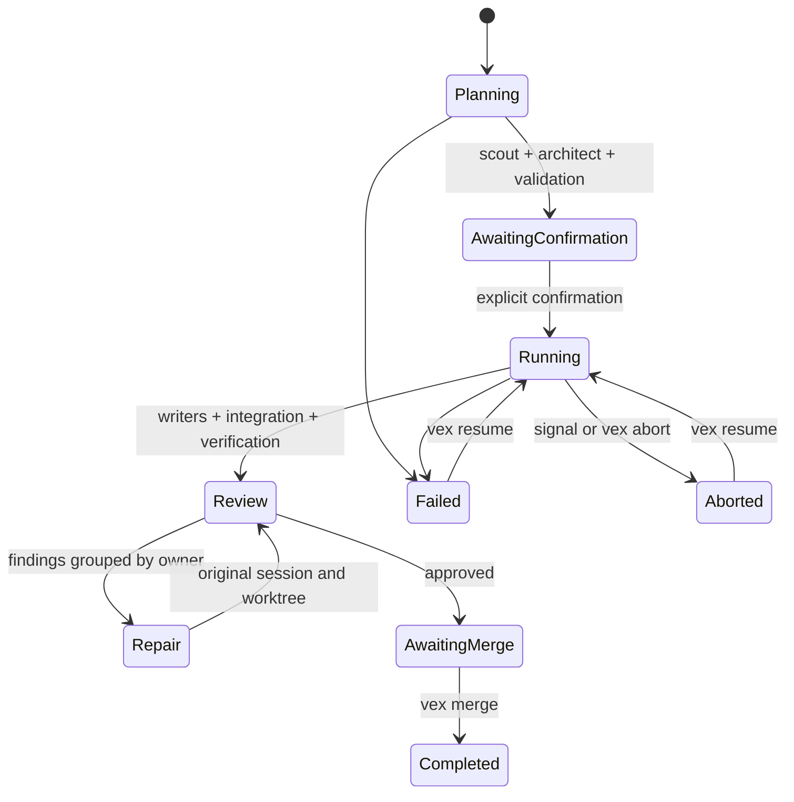

# VEX Architecture

## Product boundary

VEX is a standalone Node.js CLI. Its package boundary includes:

- the interactive terminal workspace, semantic work-mode router, and live dashboard;
- native configuration, named Provider profiles, auth, and role routing under `.vex`;
- a direct model-provider adapter;
- a native tool-calling Agent loop and session history;
- seven fixed model roles and a deterministic non-model Integrator;
- dependency scheduling, worktree isolation, ownership enforcement, review repair, artifacts, recovery, and explicit merge.

VEX does not load another coding-agent runtime, extension host, orchestration plugin, model-role preset, or third-party agent configuration. A VEX-owned transport sits behind `RoleRunner`: OpenAI-compatible Providers use Chat Completions, Anthropic-compatible Providers use native Messages, and OpenAI ChatGPT OAuth uses the Codex Responses protocol. Additional protocols can be added without changing the orchestrator.

## CLI information architecture

The no-argument entrypoint is a direct natural-language session. It presents workspace identity, isolation mode, the latest implementation run, and a single prompt. Plain text is classified as chat, read-only technical review, or implementation. Slash commands provide an explicit mode override, Provider login/selection, per-role model routing, plan, status, diff, recovery, review, merge, configuration, clear, and quit controls. Typing `/` opens a live filtered hint panel with command descriptions; Up/Down moves its active suggestion and Tab completes it. The same panel supplies known Provider, authentication method, mode, role, and discovered-model arguments. There is no numbered action menu.

Connection and routing commands use VEX-owned selectors. `/provider` is the single interactive Provider command and resolves four access states: saved OAuth session, saved API key, environment credential, or keyless local endpoint. OpenAI adds a VEX-owned method picker. The recommended method starts ChatGPT OAuth with PKCE and a random state, opens the authorization URL with the operating system's HTTPS handler, and accepts only the loopback callback at `http://localhost:1455/auth/callback`; direct API-key entry remains available. `/model` concurrently fetches every accessible live catalog and opens a full-screen two-pane selector with Providers on the left and the active Provider's models on the right. It supports SGR mouse clicks and wheel scrolling as well as keyboard navigation and type-to-filter. An argument seeds the search rather than bypassing it. After model selection, a second picker assigns the model to the session default or one fixed Agent role. Each assignment is applied immediately, marked in the role picker, and returns to the same model catalog so more roles can be configured without another network fetch; Esc completes the routing session. Provider profiles separate generation `protocol` from `modelCatalog`: OpenAI-compatible catalogs follow `GET <baseUrl>/models` with `data[].id`, while Anthropic catalogs use the same resource with cursor pagination and native authentication. This permits a gateway to expose native Messages and an OpenAI-compatible catalog independently. Bare `/route` follows the same repeated model-first flow and then requires a role; explicit `/route <role> <provider> <model>` and process options remain available for automation without depending on another CLI.

The browser path is real authorization, not a key-creation shortcut. It uses the public Codex OAuth client flow and requests `openid profile email offline_access`. VEX owns the PKCE verifier, callback server, state validation, token exchange, refresh serialization, storage, and `originator: vex` request identity. It neither reads another client's auth file nor starts another CLI. OAuth requests carry the selected ChatGPT account ID to `chatgpt.com/backend-api/codex`; API-key requests remain on the configured Platform-compatible endpoint.

All remote HTTP calls pass through one VEX network layer. It resolves an explicit `VEX_PROXY`, standard proxy environment variables, or the enabled Windows user proxy in that order and uses a shared HTTP CONNECT dispatcher. This keeps the browser authorization leg and the CLI token/model/inference legs on a consistent network path when a Windows proxy such as v2rayN is active. `NO_PROXY`/`VEX_NO_PROXY`, Windows proxy overrides, and unconditional loopback detection preserve direct access to the OAuth callback and local model endpoints. PAC and SOCKS-only endpoints are not interpreted; users select an HTTP or mixed listener instead.

## Work-mode routing



`auto` first applies deterministic multilingual safety rules. Explicit no-change and review-only language always routes to review; explicit mutation language routes to implementation; clear conversation routes to chat. Only low-confidence prompts are sent to the configured model for structured semantic classification. If that classifier cannot run, the fallback is chat, the least-capable and non-mutating mode. Short continuation prompts inherit the last resolved mode. `/mode auto|chat|review|implement` overrides the router, while `/chat`, `/assess`, and `/run` select a mode for one turn.

Capabilities are assigned after classification rather than hidden behind prompts:

| Mode | Repository tools | Writes | Durable result |
| --- | --- | --- | --- |
| Chat | none | none | in-memory conversation for the current process |
| Review | `read`, `ls`, `find`, `grep` | none | `~/.vex/reviews/<workspace-id>/<review-id>/technical-review.json` |
| Implement | fixed role-specific tools | manifest-scoped writer worktrees only | schema-5 run state, commits, findings, and integration diff |

Technical review uses the existing fixed Scout and Reviewer identities with a stricter mode-specific tool projection. It does not expose shell, write, edit, Git mutation, worktree, repair, or merge capabilities and works in both Git and ordinary directories. Chat uses a separate no-tool provider session and is never given repository content implicitly.

Mode execution reuses VEX's named Provider routing without coupling the modes together. Chat and low-confidence classification use the Architect route; technical review uses the independently configured Scout and Reviewer routes; implementation uses the complete fixed-role map. Session `/route` overrides therefore apply consistently across all three modes.

Planning and execution switch to a dashboard organized by operational questions:

1. What run and goal is active?
2. Which immutable base and integration ref are in use?
3. Which role is pending, running, complete, skipped, or failed?
4. What changed most recently?
5. How many commits, change results, and findings exist?
6. Is the integration ready for inspection and explicit merge?

TTY output is redrawn in place with ANSI styling. Non-TTY output is append-only, which keeps CI logs and shell pipelines usable. `vex status --json` exposes the durable machine-readable state.

## Native Agent runtime

`NativeAgentRunner` sends system, task, context, and bounded knowledge messages directly to the configured endpoint. It exposes only tools declared by the fixed role. Assistant tool calls are executed locally and returned as tool messages until the role calls `team_yield` or reaches `maxAgentTurns`.

Each role has a VEX-owned history at `sessions/<role>/history.json`. Review repairs reload the original owner's history, update its system/context message, and append the repair turn. Each role route contains an independent Provider profile and model. API keys are read without terminal echo. OpenAI OAuth access, refresh, ID, expiry, and account metadata are kept in the VEX auth store; refreshes are serialized so concurrent Agents do not race. OAuth response items, including opaque encrypted reasoning continuity, may be retained in role history, but auth tokens are never serialized into run state, sessions, or prompts. Keyless profiles bypass credential storage, and logout removes only VEX-saved credentials rather than changing the user's environment.

Native tools are:

- `read`, `ls`, `find`, and `grep` for repository evidence;
- `bash` for bounded checks and Git commits;
- `write` and `edit` for assignment-scoped changes;
- `team_yield` for the only structural completion path.

Path resolution rejects worktree escapes. Secret files are excluded from read/search and credential-like environment variables are removed from Agent shell processes. Read-only roles cannot edit and may not run mutating Git or shell-write commands. Writers may use `write` and `edit` only within manifest `allowedPaths`. All roles are blocked from direct network clients, destructive Git/filesystem operations, publishing, and credential-bound commands. The orchestrator additionally verifies HEAD, dirty status, commits, changed files, ownership, integration state, and command cleanliness from Git rather than trusting model output.

## Fixed roles and immutable manifest

Role definitions in `roles/*.md` are loaded and SHA-256 hashed. Exactly Scout, Architect, Backend, Frontend, Test Engineer, Reviewer, and Security Reviewer must exist, and each must declare `spawns: []`.

The Architect can create assignments only for the three writers. VEX binds those assignments into an `ExecutionManifest` with run, repository, base commit, goal, constraints, contracts, dependency graph, allowed paths, expected results, integration order, trusted project commands, risks, security decision, and role hashes.

Unknown/duplicate roles, cycles, path traversal, `.git` ownership, invalid dependencies, and overlapping write ownership fail before confirmation. Repository `.vex` configuration is ignored unless the CLI receives `--trust-project`.

## State machine



The original workspace remains unchanged throughout planning, execution, verification, repair, and review. In Git mode, `vex merge` checks the original branch and fast-forwards it. In directory mode, VEX verifies the source fingerprint and applies only the reviewed integration diff, keeping backups in the run artifacts.

The active CLI PID is recorded while planning, executing, or reviewing. In-process aborts cancel fetches and terminate project-command process trees. A separate `vex abort` can terminate the recorded CLI process tree and persist the aborted state.

## Storage

Git repositories keep the authoritative run record in the Git common directory:

```text
.git/vex/runs/<run-id>/
  state.json
  manifest.json
  scout-report.json
  role-definition-hashes.json
  events.json
  command-results.json
  review-cycles.json
  findings.json
  prompts/
  sessions/
  logs/
  results/
  changes/
```

Ordinary directories store state under `<workspace>/.vex/runs/`. Their persistent managed snapshot repositories live under `~/.vex/workspaces/` and are removed after a successful merge or cleanup. No `.git` entry is created in the source directory.

State and JSON artifacts use atomic replacement. Schema 5 records workspace mode and managed execution root, configuration source names, named Provider metadata without secrets, per-role Provider/model routes, role attempts, worktrees, changes, commands, review cycles, findings, events, integration/final refs, and active process identity. Older states are migrated for status and cleanup but cannot bypass current role-hash or merge validation.

## Extension points

The orchestration core depends on `RoleRunner`, `ProjectCommandRunner`, and `RoleKnowledgeProvider` interfaces. The default knowledge provider remains a bounded no-op. A future provider protocol or retrieval system can be injected without changing roles, permissions, scheduling, worktree ownership, or the explicit merge gate.
